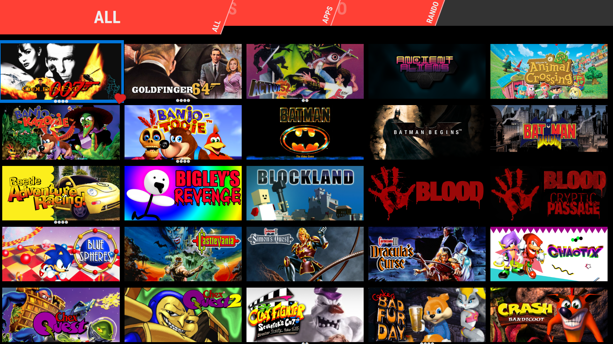

# Fullscreen Grid theme for Pegasus

A fork of the [default theme](https://github.com/mmatyas/pegasus-theme-grid) of the [Pegasus]() frontend, but with a fullscreen grid.

## Download & Installation
[Download](https://github.com/ZeeMaji/pegasus-grid-fullscreen/archive/refs/heads/main.zip)

Download & extract the pegasus-grid-fullscreen-main folder to pegasus themes folder. Themes folder locations can be found [here.](https://pegasus-frontend.org/docs/user-guide/installing-themes/)

## Changes from default theme
1. Removed game info layer and made the game grid layer take up the whole screen. Primarily tested with horizontal steam grid style images but should work with different aspect ratios too.
2. Reduced size of highlighted game grid entries so game grid images do not go off screen.
3. Games can have their favorite status toggled with the game details key rather than being a screen button in the now removed game info layer.
4. Multiplayer games now display the max number of players below their grid entry rather than in the now removed game info layer.

## License

